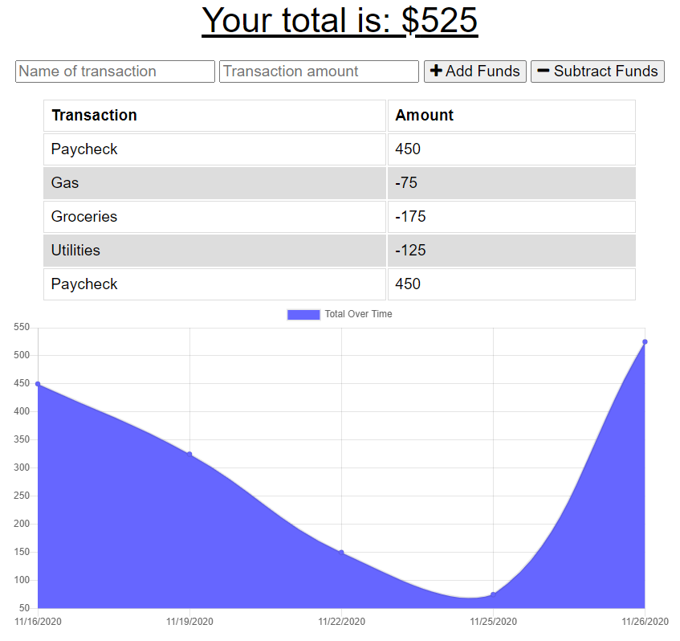
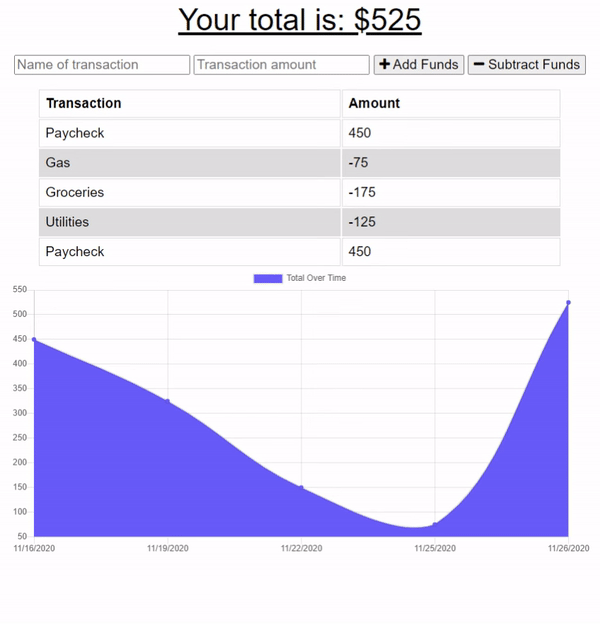
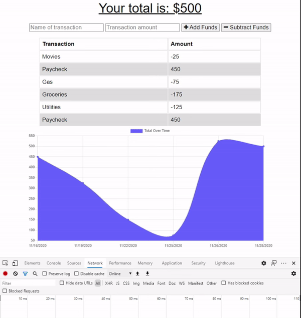

# React Book Search
[](https://opensource.org/licenses/ISC)

[Live Site - https://zar-budget.herokuapp.com/](https://zar-budget.herokuapp.com/)

## Description
An express app to track a person's budget. Data is managed in a cloud database and offline usage of the app will upload pending data upon internet connection.



## Table of Contents

1. [Installation](#1-installation)
2. [Usage](#2-usage)
3. [License](#3-license)
4. [Contributing](#4-contributing)
6. [Questions](#5-questions)

## 1 Installation
1. Download repository
	```
	HTTPS: Git clone https://github.com/Zarlengo/Offline-Budget-Tracker.git
    SSH: Git clone git@github.com:Zarlengo/Offline-Budget-Tracker.git
	```

2. Install dependencies
	```
	npm install
	```

3. Ensure a MongoDB server is running

3. Start the server
    ```
    npm run start
    ```

4. Navigate to localhost:3000

    [App running on port 3000!](http://localhost:3000)

5. To use the site without a node server. Creates a build folder with html/css/js files
    ```
    npm run build
    ```

## 2 Usage


Transactions can be entered within the input boxes along the top of the page. `Add Funds` and `Subtract Funds` manages the credit and debit of the account.



If the user is offline and transactions are entered, it will save the information locally into IndexDB until an internet connection is made. Notifications display to the user when the system is offline and when it reconnects.



## 3 License
    Copyright © 2020 Chris Zarlengo
    Permission to use, copy, modify, and/or distribute this software for any
    purpose with or without fee is hereby granted, provided that the above
    copyright notice and this permission notice appear in all copies.

    THE SOFTWARE IS PROVIDED "AS IS" AND THE AUTHOR DISCLAIMS ALL WARRANTIES
    WITH REGARD TO THIS SOFTWARE INCLUDING ALL IMPLIED WARRANTIES OF
    MERCHANTABILITY AND FITNESS. IN NO EVENT SHALL THE AUTHOR BE LIABLE FOR ANY
    SPECIAL, DIRECT, INDIRECT, OR CONSEQUENTIAL DAMAGES OR ANY DAMAGES
    WHATSOEVER RESULTING FROM LOSS OF USE, DATA OR PROFITS, WHETHER IN AN ACTION
    OF CONTRACT, NEGLIGENCE OR OTHER TORTIOUS ACTION, ARISING OUT OF OR IN
    CONNECTION WITH THE USE OR PERFORMANCE OF THIS SOFTWARE.

## 4 Contributing
* [Zarlengo](https://github.com/Zarlengo)

## 5 Questions
* [Github Profile for Zarlengo](https://github.com/Zarlengo)
* [Send email to christopher@zarlengo.net](mailto:christopher@zarlengo.net)
* [File an issue](https://github.com/Zarlengo/Offline-Budget-Tracker/issues)
